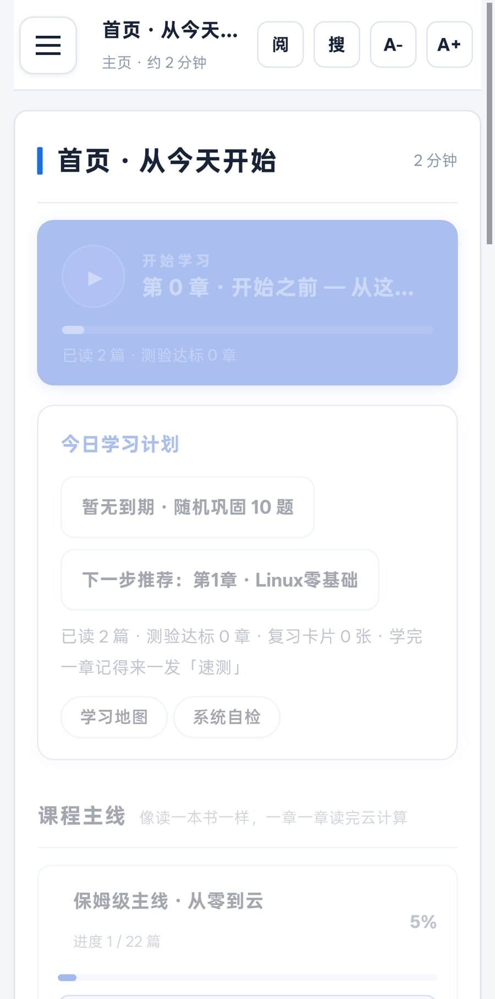
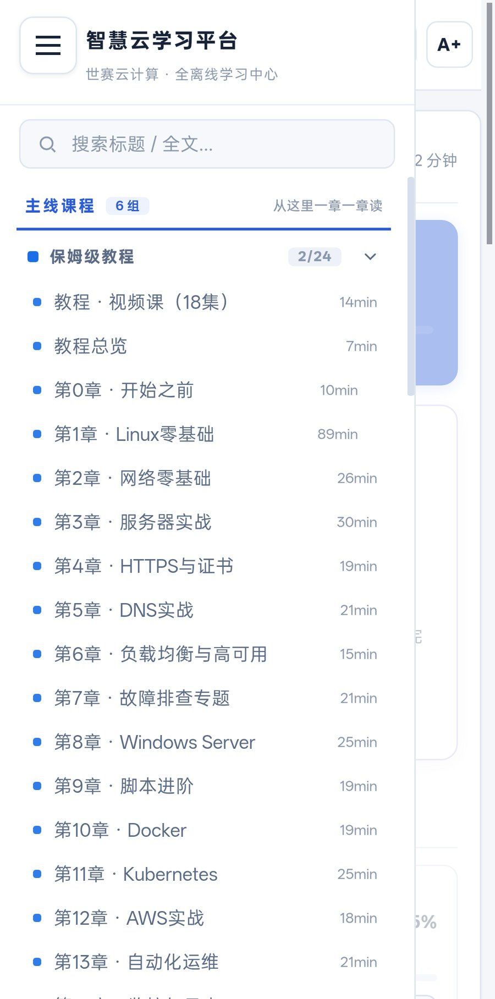
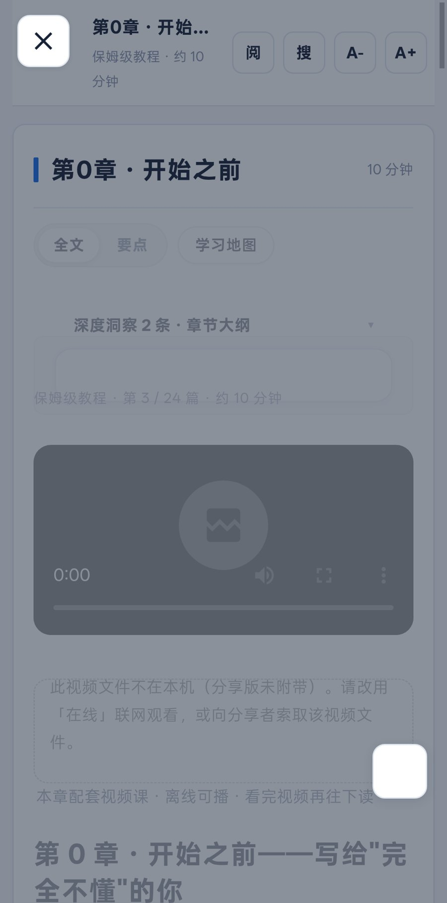

# 云计算学习中心 · WorldSkills Cloud Computing 中文学习资料库

> 🏅 **世界技能大赛 · 云计算项目（Skill 39）中文备赛资源库**
> 第 48 届世界技能大赛 2026 年 9 月在中国 · 上海举办
>
> 由**山东工业技师学院学生**在自学过程中独立整理开发：
> **20 章保姆级教程 + 62 集视频课 + 59 份国际赛题中文库 + 50 赛项全技能库 + 全功能离线 App**
>
> **一个仓库，从零基础到竞赛水平。全部免费。**
>
> 🌐 **在线使用**：<https://taimabenji.github.io/worldskills-cloud/>





---

## 👋 这个仓库写给谁

- 在技校 / 职校学计算机，觉得学校资料太少、没人带
- 想参加世界技能大赛（云计算 / 云运维），但搜不到中文真题
- 完全零基础，看到「服务器」「Linux」就发怵，不知道从哪迈第一步
- 想转行做云运维 / DevOps，需要一条真实、能走通的学习路线

中了任何一条 —— 从下面这条开始就行：

> **「你不需要会电脑，就能学会云计算。」**
> —— [第 0 章 · 开始之前（零基础先读我）](docs/tutorial/00-开始之前-零基础先读我.md)

---

## 📚 包含什么

| 模块 | 内容 | 位置 |
|------|------|------|
|  **保姆级中文教程**（20 章 + 附录） | 从"什么是文件"讲到 AWS/容器/自动化/安全/机房管理/装机/编译原理/锐捷云平台，每步带命令、输出示例、排错指南与练习答案 | [`docs/tutorial/`](docs/tutorial/) |
|  **视频课**（62 集） | 机房管理 15 集 · 保姆级教程 18 集 · 进阶专题 29 集；已随库内置（`videos/` 目录，门户/阅读器内直接播放）；或从 Releases 下载原片 | [Releases 下载](https://github.com/TaiMaBenJi/worldskills-cloud/releases/latest) |
|  **精通之路**（7 篇） | 从"级联话术"到母语级能力的训练体系：全景地图 / 五级阶梯 / 领域修炼 / 架构模式 / 全平台 / 365 天训练系统 | [`docs/mastery/`](docs/mastery/) |
|  **计算机母语之路**（5 篇） | 《计算机系统要素》《C Primer Plus》《思考快与慢》《编译原理》《高级编译器》五书共生学习体系（24 个月路线） | [`docs/cs-mastery/`](docs/cs-mastery/) |
|  **知识体系**（12 章） | Linux / 网络 / 企业服务 / OpenStack / AWS / 容器 / IaC / 可观测 / 安全 / 前沿 / 竞赛 / 认证 | [`docs/knowledge/`](docs/knowledge/) |
|  **机房管理修炼体系**（11 篇） | 从供电制冷到 PXE 装机、应急演练、职业路线的完整机房之路 | [`docs/room/`](docs/room/) |
|  **韩国赛题中文库**（59 份） | 2021–2025 韩国技能竞赛云计算真题：题面 + 评分标准（全中文翻译，评分命令可直接照用） | [`exam/korea-zh/`](exam/korea-zh/) |
|  **模拟实训室** | 22 个实战场景 + 4 套模拟赛卷，浏览器内真操作、自动评分 | [`lab/`](lab/) |
|  **资源库**（713 条） | B站精选学习视频：装机 / 计算机 / 编译原理 / 进阶，支持搜索 / 已看 / 收藏 | 内置 App 与 study.html |
|  **离线学习中心（单文件）** | `study.html`（14.1 MB）：3200+ 篇资料全文检索、阅读进度记忆、扁平简约界面、完全离线 | [v3.0 下载](https://github.com/TaiMaBenJi/worldskills-cloud/releases/tag/v3.0) |
|  **Android App** | `CloudStudy-v3.0-android-full.apk`（506 MB · 全视频离线版）/ `-lite.apk`（9 MB · 文档+图解+模拟训练） | [v3.0 下载](https://github.com/TaiMaBenJi/worldskills-cloud/releases/tag/v3.0) |
|  **iOS App** | `CloudStudy-v3.0-ios-*-unsigned.ipa`（免签名 IPA，用 Sideloadly / AltStore 以自己 Apple ID 侧载） | [v3.0 下载](https://github.com/TaiMaBenJi/worldskills-cloud/releases/tag/v3.0) |
|  **Windows 版（14.2 MB）** | 单文件 `CloudStudy-v3.0-windows-x64.exe`，双击自动释放学习中心并用浏览器打开，免安装 | [v3.0 下载](https://github.com/TaiMaBenJi/worldskills-cloud/releases/tag/v3.0) |
|  **全技能精通库（六大领域 · 50 赛项）** | 世界技能大赛六大领域约 50 个赛项：项目总纲 · 精通路线图与能力域图解 · 十题交互模拟训练 · 中文解说总纲课视频 | [`multiskill/`](multiskill/) |

## 🚀 多端使用（一个内容源 · 四端统一发布）

> Android / iOS / Windows / Web 由 GitHub Actions 从**同一份内容**（`study.html` + `videos/` + `multiskill/`）构建，
> 版本统一为 **v3.0**，全部在 [**Releases · v3.0 多端统一版**](https://github.com/TaiMaBenJi/worldskills-cloud/releases/tag/v3.0)。

**⭐ 在线打开分类门户（推荐 · 零安装）**
👉 **<https://taimabenji.github.io/worldskills-cloud/>** —— GitHub Pages 直接打开：**[分类门户](https://taimabenji.github.io/worldskills-cloud/)**（仿政务教育网站风格：报头 + 频道导航 + 分类板块，支持全站搜索）· **[图文阅读器](https://taimabenji.github.io/worldskills-cloud/viewer.html)**（目录 / 代码块 / 表格 / 赛项图解与视频内嵌）· **[B 站精选资源库](https://taimabenji.github.io/worldskills-cloud/resources.html)**（713 条）。本地双击 `index.html` 亦可用（阅读器需本地服务器，如 `python3 -m http.server`）。

**① 手机装 App**
- **Android**：下载 `CloudStudy-v3.0-android-full.apk`（506 MB · 全视频离线）或 `-lite.apk`（9 MB）→ 安装即用。
  > 系统提示"未知来源/风险应用"属正常侧载提示。
- **iOS**：下载 `CloudStudy-v3.0-ios-*-unsigned.ipa` → 用电脑端 Sideloadly（或 AltStore）以自己 Apple ID 重签侧载 → 「设置 → 通用 → VPN与设备管理」信任证书。
  > 免签名 IPA 受 Apple 限制必须经侧载工具安装；免费 Apple ID 签名 7 天有效，可一键续签。

**② 浏览器打开学习中心**
从 [v3.0 Release](https://github.com/TaiMaBenJi/worldskills-cloud/releases/tag/v3.0) 下载 `study.html`（单文件）→ 任意浏览器直接打开；或在线版：<https://taimabenji.github.io/worldskills-cloud/study.html>。

**③ Windows 双击即用**
下载 `CloudStudy-v3.0-windows-x64.exe` → 双击 → 自动打开学习中心（免安装，单文件）。

**④ 直接读文档**
从 [`docs/tutorial/00-开始之前`](docs/tutorial/00-开始之前-零基础先读我.md) 开始，按顺序阅读。

## 📁 目录结构

```
worldskills-cloud/
├── study.html  #  ⭐ 单文件学习中心（Web 版；与 Android/iOS/Windows 同一内容源）
├── index.html  #  分类门户首页（政务教育网风格 · 归类导航 + 全站搜索）
├── viewer.html  #  图文阅读器（Markdown 渲染 · 目录 · 图解/视频自动内嵌）
├── resources.html  #  B 站精选资源库（分组 + 搜索）
├── clients/  #  四端统一工程（android 构建脚本 / ios XcodeGen 工程 / windows zig 源码）
├── .github/workflows/  #  云端构建流水线（build-android / build-ios / build-windows）
├── videos/  #  视频课 62 集 + 图解 gallery（相对路径，各端同构引用）
├── multiskill/  #  全技能精通库（6 领域 50 赛项：总纲/图解/模拟训练/总纲课视频）
├── app/  # 学习引擎源码（段位体系 / 资源库 / 门户数据 portal-data.js）
├── lab/  # 模拟实训室引擎（22 场景 + 4 套模拟赛卷）
├── docs/  # 教程与知识体系（Markdown 源）
│  ├── tutorial/  #  20 章保姆级教程 + 附录
│  ├── mastery/  #  精通之路 7 篇
│  ├── cs-mastery/  #  计算机母语之路 5 篇
│  ├── knowledge/  #  知识体系 12 章
│  ├── room/  #  机房管理修炼体系 11 篇
│  ├── sprint/  #  冲刺作战手册
│  └── official/  #  WSOS 官方标准（中 / 英）
├── exam/
│  └── korea-zh/  # 韩国赛题中文翻译（题面 + 评分标准）
├── tools/  # 构建工具链（页面生成器 / APK 构建材料 / 小工具）
├── video-factory/  # 视频课生成流水线（Markdown → 视频课）
├── video-ext/  # 进阶视频课总览
└── assets/  # 截图
```

## 🔧 自行构建

### 云端一键出包（推荐 · 四端统一）

GitHub → **Actions** → 选择工作流 → **Run workflow**：

| 工作流 | 产物 | 输入 |
|---|---|---|
| `build-android` | `CloudStudy-v3.0-android-{lite,full}.apk` | `variant`: lite / full / both |
| `build-ios` | `CloudStudy-v3.0-ios-{lite,full}-unsigned.ipa`（macOS 运行器，免签名） | `variant`: lite / full |
| `build-windows` | `CloudStudy-v3.0-windows-x64.exe`（zig 交叉编译） | — |

填 `upload_release: v3.0` 即自动上传到 Releases；四端工程源码在 [`clients/`](clients/)（含 iOS 侧载说明）。

### 重新生成学习中心（study.html）

```bash
# 环境：Python 3 + Pillow；依赖 Markdown 库
pip install markdown pillow
# VIDEO_MODE=relative 生成"全平台统一相对引用"版本（Web/APK/iOS/桌面通用）
VIDEO_MODE=relative LIQ_OUT=study.html python3 tools/build_liquid.py
```

### 构建安卓 App（本机 / 历史流程）

`tools/rebuild_full.sh`（一键构建脚本）与 `clients/android/build_ci.sh`（云端同款）展示完整流程：
生成 `study.html` → 铺 assets（含视频）→ `smali.jar` 汇编 dex → `aapt2 compile/link` → 合并 dex → `apksigner` 签名。
模板（`tools/apk-template/`）包含可直接复用的 Manifest、Activity 源码与图标。

## 🙏 内容来源与致谢

- **本项目**：由**山东工业技师学院学生**在自学过程中独立整理与开发，教程与方法论均为原创编写，欢迎交流指正
- **官方**：WorldSkills Occupational Standards（WSOS 2026 上海）
- **赛题**：韩国技能竞赛公开资料、各国选手公开训练仓库等**公开渠道**整理
- **教程与方法论**：本项目原创编写
- 资料仅供学习交流，相关版权归原出处所有；如涉版权问题请提 Issue 处理。

## 📄 License

- 代码与工具：**MIT**（见 [LICENSE](LICENSE)）
- 原创文档与教程：**CC BY-NC-SA 4.0**（署名-非商业性使用-相同方式共享）

## 🗺️ 路线图

- [x] 保姆级教程 20 章 + 附录（含装机、编译原理、锐捷云平台）
- [x] 视频课 62 集（机房管理 / 保姆级教程 / 进阶专题）
- [x] 资源库：713 条 B站精选
- [x] 段位体系 + 模拟实训室（22 场景 / 4 套模拟赛卷）
- [x] 界面重塑 v3（扁平简约、白卡片、分区导航、沉浸阅读）
- [x] **多端统一 v3.0：Android APK / iOS IPA / Windows EXE / Web 同源同版 · 云端流水线一键出包**
- [ ] 收录更多国家/地区赛题（中 / 英 / 日 / 葡…）
- [ ] B站课程下载队列收尾（约 15 门大课）

---

**如果这个项目帮到了你，给一个  Star 就是最好的支持。**
