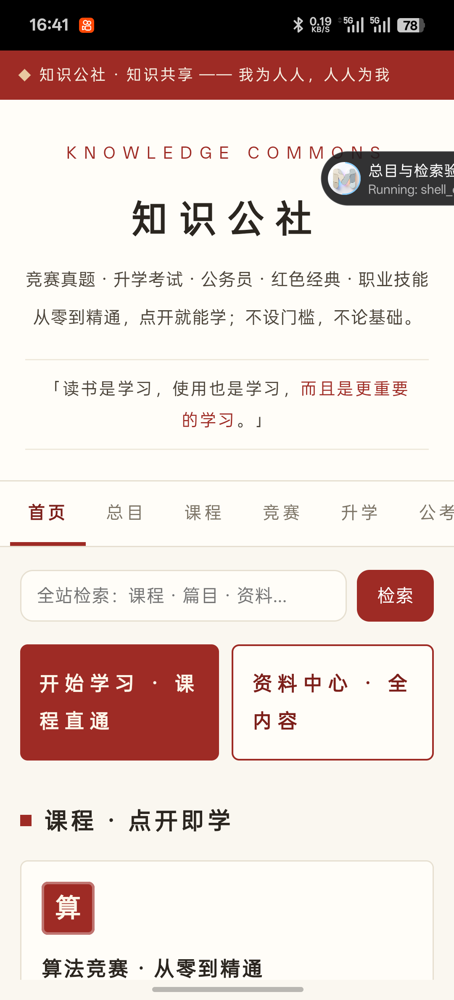
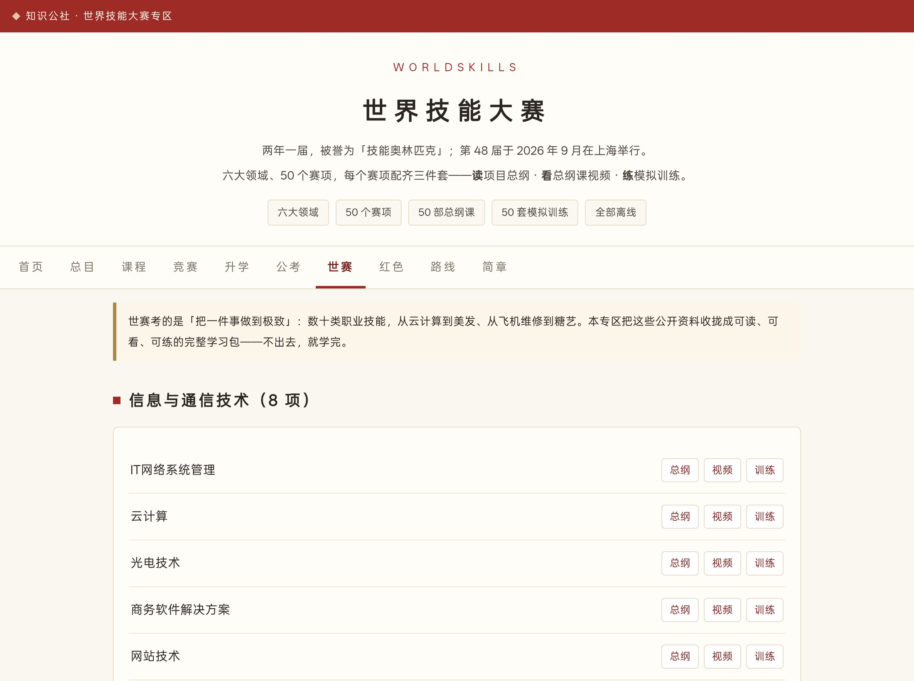

# 知识公社 · Knowledge Commons

> **让每一个人都能免费学习。**
> 竞赛真题 · 升学考试 · 公务员 · 红色经典 · 世界技能大赛 · 全网资源总库 —— 完全离线、完全开源。

不设门槛，不论基础：只要想学，这里全都有。

把散落各处的公开学习资源收集、分类、编好「从零到精通」的路线，装进同一个 App / 网站里——让"不知道去哪学、从哪开始"的人，打开就能学。

**立即使用**

> 🏗️ **架构升级**：门户层已迁移至 **React + Vite + TypeScript + Tailwind CSS 4**（`web/` 目录，URL 与旧版完全一致）。详见 [docs/react-migration.md](docs/react-migration.md)。

- 网页版（无需安装）：https://88lin.github.io/knowledge-commons/learn/
  　· 手机/电脑浏览器打开后，可直接「添加到主屏幕 / 安装」——独立图标、全屏、离线可用，等于一个 App（PWA），且版本永远最新
- 资源总库（全网免费学习资源 787 条精选）：https://88lin.github.io/knowledge-commons/library.html
- 资料中心（全技能库 · 单文件）：https://88lin.github.io/knowledge-commons/study.html
- 全平台下载页：https://88lin.github.io/knowledge-commons/download.html
  　· Android APK / iOS IPA（含电脑签名三路线）/ Windows EXE / macOS App / Linux 单文件 / Web 六端矩阵
- 下载安装包：[Releases](../../releases) —— 六端产物统一发布



## 内容总览

| 板块 | 内容 |
|---|---|
| 全年考试日历 | 按月速查高考 / 专升本 / 考研 / 公考 / 教资 / 法考 / 软考 / 四六级 / 计算机等级的报名与笔试节奏，附官方入口 |
| 零基础学堂 | 全站使用指南 + 九大板块「第一课」+ 进阶篇，共 16 节视频 + 图文讲义：世赛 / 算法 / 升学 / 公考 / 经典 / 课程 / 编程 / 考证 / 人文——每课回答「这是什么、今天第一步做什么、学完去哪」，附动手作业 |
| 课程（原创编写） | 算法竞赛 13 讲 · Python 入门 8 讲 · 行测入门 6 讲 —— 从零开始，学完能上手 |
| 竞赛真题 | Codeforces 11425 题 + AtCoder 9600 题（离线可搜索）；ICPC 世界总决赛题解 158 份；CCPC 题面；蓝桥杯题解 168 份；天梯赛解析 28 份 |
| 升学考试 | 高考数学真卷 ×4（内置阅读器）；辽宁专升本备考助手 |
| 公务员考试 | 图形推理真题库 354 题逐题解析；国考 / 省考资料导航 |
| 红色经典 | 《毛泽东选集》第 1–5 卷全文 229 篇 + 毛泽东诗词 90 首，全部离线可读 |
| 社会主义实践研究 | 研究生级研究中心（learn/socialism.html）：七大领域研究地图、21 方向选题库、六步可打卡研究路线、每日理论雷达；资源总库新增「社会主义实践研究」板块 169 条（经典文献 / 党史国史 / 新闻理论 / 数据实证 / 国际视野 / 方法升学，逐条核验）；配套研究文档九篇（docs/socialism/） |
├── docs/ecommerce/     # 电商创业手册：总纲+七章文档+三张工作表 CSV
├── learn/ecommerce.html # 电商创业·实战中心（2026 实价手册 + 90 天路线）
| 世界技能大赛 | 六大领域 50 个赛项：**总纲（读）· 总纲课视频（看）· 模拟训练（练）三件套站内直达**；另含 62 集视频课与真题资料库 |
| 学习路线 | 算法竞赛 / 公务员 / 专升本 / 高考：四份「从零到精通」分阶段路线图 |
| 资源总库 | 全网免费学习资源 787 条精选（十一大板块）：世赛官方标准与真题直链、模拟器与靶场、算法 Wiki 与开源书、升学真题官方渠道、公考题库、马列古籍全文、MOOC 与 IT 工具、职业考证与语言、数字人文视听、社会主义实践研究、电商创业实战——分类可搜，直连 / 离线性逐条标注 |
| 总目 · 全站检索 | 站内全库一页直达；离线全站索引（课程 / 篇目 / 资料一搜即中） |



## 特性

- **完全离线**：全部内容无需联网（Android 全量包约 560 MB）
- **加到桌面即装即用**：网页版为完整 PWA —— 浏览器打开即可安装到主屏幕/桌面，独立图标、离线可用、随源更新，四个系统一个体验
- **站内直达**：从首页到任一赛项、任一篇目、任一真题，全部站内一跳可达，不跳第三方
- **六端同源**：Android / iOS / Windows / macOS / Linux / Web 由同一内容源构建，GitHub Actions 一键出包
- **iOS 签名一条龙**：免签名 IPA（Sideloadly/AltStore 免费 Apple ID 侧载）＋ 电脑本机 zsign 签名脚本（Windows `sign.ps1`）＋ 云端 `sign-ios` 工作流（配证书 Secrets 自动出已签名 IPA）
- **全量质检**：每轮发布前对全部视频逐部解码体检（零基础学堂 15 集 + 机房 / 保姆级 / 进阶等系列全部逐部体检）、页面逐项实测
- **开源共建**：内容与构建流程全部开源，欢迎补充与修正

## 目录结构

```
├── learn/          # 知识公社门户（课程/竞赛/升学/公考/红色/世赛/路线/总目/检索）
├── library.html    # 资源总库：全网免费学习资源精选（787 条，分类可搜，直连/离线性标注）
├── study.html      # 资料中心：全技能库 + 视频课 + 真题库（单文件应用）
├── download.html   # 全平台下载页（六端矩阵 + iOS 签名指南）
├── multiskill/     # 世界技能大赛 50 赛项学习包（总纲 / 视频 / 模拟训练 / 图解）
├── videos/         # 62 集视频课与图解；videos/beginner/ 为零基础学堂 15 集
├── docs/ exam/     # 课程文档与真题资料
├── clients/        # 六端客户端工程（android / ios / windows / macos / linux）
├── tools/          # 构建工具与质检脚本（资源名修复 / 视频体检 等）
└── .github/        # GitHub Actions 工作流（android / ios / sign-ios / windows / macos / linux / 视频）
```

## 构建与质检

- **云端**：GitHub Actions —— `build-android` / `build-ios` / `sign-ios` / `build-windows` / `build-macos` / `build-linux`（workflow_dispatch，可指定上传到 Release；`sign-ios` 需配置 `IOS_P12_B64` / `IOS_P12_PASS` / `IOS_MP_B64` 三个 Secrets）
- **本地**：`clients/android/build_ci.sh` 在装有 Android SDK 的环境可直接构建；`clients/windows` 与 `clients/linux` 需 zig；`clients/macos` 与 `clients/ios` 需 macOS + Xcode；Windows 本机签 IPA：`clients/ios/sign.ps1`（zsign）
- **质检**：`tools/qc/full_media_probe.py <目录>` 对全部视频逐部解码体检（0 错误为通过）
- **链接体检**：`python tools/linkcheck.py` 并发检测资源总库全部外链（反爬识别为 blocked，多轮重试后才判死链）
- **资源名说明**：部分 Android WebView 无法访问含非 ASCII 字符的资源路径，构建流程中的 `tools/android_namefix.py` 会把中文资源名转义为 `_uXXXX` 并同步改写引用（详见脚本注释）

## study.html 秒开架构（2026-10）

资料中心 `study.html`（3161 篇 · 59 组）不再内联 14MB 全量数据，首屏体积 **14.8MB → ~757KB（-95%）**：

- `study-data/manifest.<gen8>.js` — 全量元数据（标题/分组/时长/主题色，3161 篇）+ 首页全文，~731KB
- `study-data/c/<组slug>.<hash6>.js` — 58 个按组内容块，打开该组文档时按需加载，后台自动预取全部
- 搜索：标题即时全库命中；全文匹配随内容块加载而就绪（预取完成后全库可搜）
- Service Worker：`study-data/*` 走运行时缓存，首次在线访问后全站离线可用

**再生成安全**：`tools/build_liquid.py` 末尾已接入 `tools/split_study.py`，重新生成 study.html 时自动完成拆分，无需手工步骤。改动内容数据后发布时请同步 bump `sw.js` 的 `VERSION`（如 `kc-v1.6.1`），让离线用户的缓存及时刷新。

## 数据来源与致谢

题库索引来自 Codeforces 公开 API 与 kenkoooo AtCoder Problems；
题解 / 笔记 / 真题来自公众分享的开源仓库（ACMFinalsSolutions、LanQiaoCode_Python、tianti_learning_notes、maoxuan-wiki 等）；
官方资源直达国家中小学智慧教育平台、国家数字图书馆、中国政府网等。

各资料的版权归其原始作者与机构所有。本项目仅做**收集、分类与离线化**，供个人学习交流使用，请勿用于商业用途。

## 参与共建

- 发现内容错误、想补充资料、或想参与开发 —— 欢迎开 Issue / PR
- 想加入的内容（新的科目、省份真题、赛事资料）都可以提出，收集到就会加进来

## 最近更新

- **2026-10-07**：新增「**社会主义实践 · 研究生研究中心**」（learn/socialism.html）——研究生级全领域研究模块：总纲四步研究法（读原著/通党史/盯前沿/做实证）、七大领域资源直达卡、六步研究力路线（进度保存在本机，可打卡）、**21 方向选题库**（含切入角度与数据可得性提示）、每日理论雷达（求是/人民网理论/国新办白皮书/统计局等 8 个官方入口）、文献/实证/写作三条方法流水线；资源总库新增第十一大板块「**社会主义实践研究**」**169 条**——马恩列斯毛原文库与领袖文选官方全文（含 marxists.org 标注国际网络）、党史国史档案与数字展馆 39 条、央媒理论阵地与人民日报图文数据库等 39 条、国家统计局/普查公报/CFPS/CGSS 等数据实证 34 条、越南古巴老挝官方媒体与世界社会主义研究 15 条、CSSCI/GB/T 7714/研招网等学术发展 19 条，全部逐条实测可达；docs/socialism/ 新增总纲 + 八篇分领域研究文档（含 201 条资源清单）；检索索引扩至 1870 条，PWA 预缓存升 kc-v1.5.0；**修复资源总库自 2026-10-05 扩容起 8 处缺逗号语法错误（该错误导致线上资源总库渲染 0 条）**，esprima 全文件解析验证通过
- **2026-10-05（三）**：新增「学堂自测」（learn/quiz.html）——16 课 × 8 题共 128 道选择题，即时判分 + 逐题解析，最高分存本机；题库扩至每课 8 题；学堂每课卡片「测一测」深链直达；学堂页 / 总目 / 检索 / PWA 预缓存（v1.4.2）全部接入
- **2026-10-05（二）**：资源总库世赛板块新增「云计算与运维专项」12 条——OpenStack 中文文档 / ArchWiki / 鸟哥私房菜 / HAProxy / Windows Server 文档 / Proxmox / Ansible / Terraform / WireGuard / Samba 等，全部实测可达；总数 **580 条**；考试日历新增「我的考试清单」收藏（本机保存）
- **2026-10-05**：新增「全年考试日历」（learn/calendar.html，学堂/日历 tab）——12 个月报名与笔试节奏 + 官方入口，每年循环可用；新增学堂第 0 课「知识公社使用指南」（全站导览视频 3 分钟），学堂共 **16 节视频课**；检索索引 1655 条；PWA 预缓存 v1.4.1
- **2026-10-04（九）**：资源总库新增「健康·法律·公民服务」子类 12 条——国家法律法规数据库、裁判文书网、12348 法网、疾控中心、医保/税务/12315 等政务平台、国标全文公开系统，全部官方免费且逐条实测；总数 **580 条**；学堂 15 集视频全量解码体检 0 错误（tools/qc 标准）
- **2026-10-04（八）**：学堂进阶篇二期——新增 3 集进阶课（升学三类考试三套打法 / 公考行测提分顺序与申论写改重写闭环 / 考证「大纲变日历」四步法），学堂共 **15 节视频课**（基础 9 + 进阶 6）；学习路线页四条路线接入对应学堂课；PWA 预缓存升级 kc-v1.4.0
- **2026-10-04（七）**：全库链接体检——新增 `tools/linkcheck.py`（并发检测 + 反爬识别 + 多轮重试），对资源总库 553 个外链全部实测：修复 5 条失效/搬迁链接（Erickson《Algorithms》新址、盖蒂开放内容新址、B站检索链接规范化），剔除 5 条确认失效条目（竹马、CCTV 旧片库、微软培训旧页、国图老入口、鲁迅博物馆检索系统），总数 561 → **580 条**，全库健康度复验通过
- **2026-10-04（六）**：新增「零基础学堂」（learn/beginner.html + 学堂 tab）——九大板块各一节零基础第一课视频（video-factory 流水线从分镜脚本自动生成：PIL 渲染 + edge-tts 配音 + ffmpeg 合成），每课附图文讲义与动手作业；新增 `video-factory/build_episode_win.py`（Windows 本地构建器，用系统雅黑字体与 imageio-ffmpeg，分镜格式与手机管线通用），9 集分镜脚本入库 `video-factory/scripts/beginner-b01..09.py`；全站导航、检索索引（990 条）与 PWA 预缓存同步接入

- **2026-10-04（五）**：资源总库与 399 条版合并去重，扩至 **580 条 · 九大板块**——并入「数字人文·视听」（故宫数字文物库、全景故宫、卢浮宫 / 大都会 / 盖蒂开放馆藏、云听、数字科技馆等 33 条）、「职业考证·语言」增补 30 条（法考 / 医学 / 财会 / 建工 / 软考 / 特种作业与无人机官方渠道）、算法板块「AI 与数据实战」35 条（魔搭 / 天池 / Datawhale 大模型系列 / 开放数据集）、升学板块「学科奥赛 / 科创大赛 / 家庭教育」23 条、开放课程板块「多语种与小语种」41 条（NHK / 歌德 / DW / JLPT / TOPIK / HSK 官方渠道）；全站介绍同步更新，检索索引扩至 980 条，资料中心首页加总库入口
- **2026-10-04（四）**：直装页新增「免费路线（0 元）」专区——Sideloadly/AltStore 自动续签、SideStore 免电脑续签、TrollStore 兼容机型永久直装、共享证书风险提示；矩阵补充 SideStore 说明
- **2026-10-04（三）**：iOS「签名 → 任何人可装」闭环——新增站内直装页 **install.html**（itms-services 一键安装 + 发布状态自动探测 + 证书信任指引 + 七条分发路线实话矩阵）；`sign-ios` 签名后自动生成苹果 OTA 安装清单 `manifest.plist` 并随 Release 发布，把直装页链接发给任何人即可免电脑安装（能否「任何人」取决于证书类型：企业签/Ad Hoc/TestFlight/App Store，详见直装页）
- **2026-10-04（二）**：检索与收录收尾——sitemap.xml 收录全平台下载页并刷新 lastmod；全站检索索引补齐「资源总库 / 全平台下载 / 资料中心 / B站精选」四页（418 条）；Service Worker 升级 kc-v1.3.1 预缓存同步刷新
- **2026-10-04**：资源总库扩至 **399 条**（新增 65 条，全网检索 + 逐条在线核验、与存量零重复），新增第八大板块「**职业考证·语言**」（教资 / 会计·CPA / 法考 / 医考护考 / 软考 / 四六级考研英语 / 雅思托福 / JLPT 等 23 条官方渠道）；世赛、算法、升学、公考、红色古籍、开放课程、IT 工具七组各增补 5–8 条（中国大百科全书网络版、故宫名画记、硅基流动、公考雷达等）
- **2026-10-03（二）**：全平台拉满——新增 macOS App（通用二进制）与 Linux 单文件（musl 静态）构建工作流，六端矩阵齐发；新增站内「全平台下载页」download.html（含 iOS 签名三条路线指南）；iOS 电脑签名落地：Windows 一键脚本 `clients/ios/sign.ps1`（自动下载 zsign）+ 云端 `sign-ios` 签名工作流（p12/描述文件 Secrets）
- **2026-10-03**：新增「资源总库」（library.html）——七大板块 334 条全网免费学习资源精选（世赛官方赛项页 / WSOS 标准 / 技术描述 PDF 直链、国赛规程赛卷、模拟器与漏洞靶场、算法竞赛 Wiki / 免费教材 / 开源模板库、升学与公考官方真题渠道、马列与古籍全文库、MOOC / 电子书 / IT 文档与工具），全部人工检索核验，标注免费程度、可离线性与直连性；已接入门户导航、总目、世赛专区与 PWA 预缓存
- **2026-09-28**：新增「世赛」专区（50 赛项三件套站内直达）、「总目」与全站检索；原创课程上线；全量视频解码质检与修复（112 部 0 错误）

## 理念

知识并不稀缺，稀缺的是「知道去哪找、从哪开始」。
我们希望把信息差一个个消掉，让知识回归它本来的位置——**属于每一个人**。

> 无产者在这个革命中失去的只是锁链。他们获得的将是整个世界。
> **全世界无产者，联合起来！**
